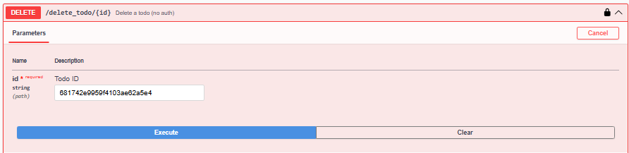
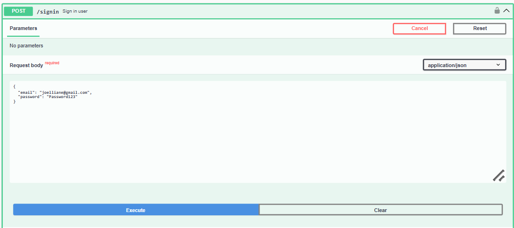
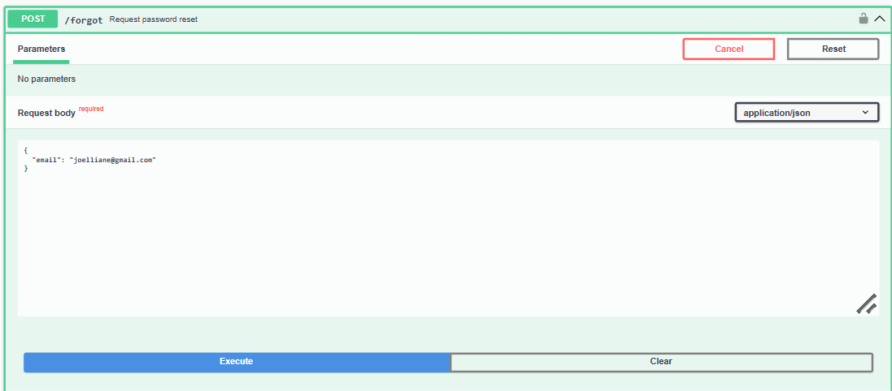

# API Documentation Testing Results

Name: Joelliane Anggra
Binusian ID: 2802466322
Class: B4CC

access the full api docs here: http://localhost:5000/todolist/api-docs

## Todo

*/get_all*
---

Get all todo list from database (auth required)

*/add_todo*
---

Add a new todo list (auth required)

*/update_todo/{id}*
---

Update todo list (auth required)

*/delete_todo/{id}*
---

Delete a todo (no auth)

*when there is no authentication*

## User

*/user-infor*
---

Get user information (need auth)

*/signup*
---

Sign up a new user

*/activate/{activation_token}*
---

Activates user account using a token

*/activation*
---

Activate user email

*/signin*
---

Sign in user

*/select-role*
---

Select user role after login (if user has more than 1 roles)

*/refresh_token*
---

Refresh access token

*/forgot*
---

Request password reset

*/reset*
---

Reset user password (need auth)

*/users/{id}*
---

Get user information by user ID (need auth)

*/get_staffs*
---

Get all users staff (need auth)

*/all_infor*
---

Get all users information (need auth)

*/logout*
---

Logout user

*/update_user*
---

Update user information (need auth)

*/update_role/{id}*
---

Update user role (need auth)

*/update_user_status/{id}*
---

Change the status of a user (eg., active, inactive)

*when there is no authentication*

*when admin/staff authentication is reinforced*

*when admin authentication is reinforced*

---

Updated DockerHub Link: https://hub.docker.com/repository/docker/joelliane/to-do-list-mern-updated

---

# Postman API Testing Results

*createTodo*
---

*getAllTodos*
---

*updateTodo*
---

*deleteTodo*
---

---

DockerHub Link: https://hub.docker.com/repository/docker/joelliane/to_do_list_mern
